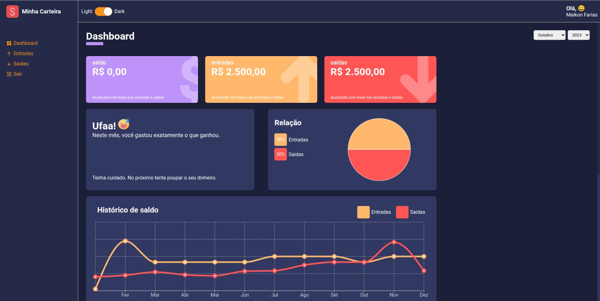
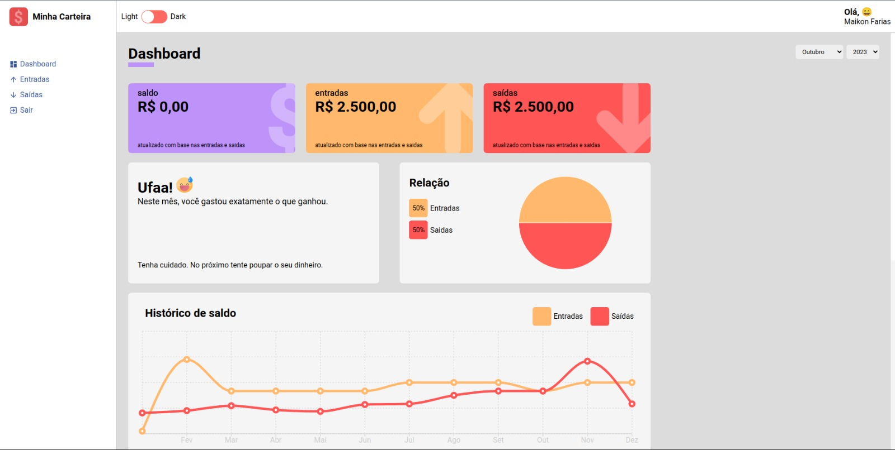

# React Dasboards

## Repositório de um projeto em React com Dashboards

<h3>Tecnologias utilizadas: React, Html, Css, TypeScript, Recharts</h3>

### Projeto Finalizado!!!

A idéia é no futuro fazer algo parecido, mas com algum outro framework, como Next.js ou Remix, e integrar com um banco de Dados.

 
 
 
 
 
 
 

[Caso queira ver o vídeo do projeto, clique Aqui.](https://www.linkedin.com/posts/maikon-farias-java_um-amigo-falou-sobre-a-necessidade-de-um-activity-7148840829120389120-E0FI?utm_source=share&utm_medium=member_desktop)
